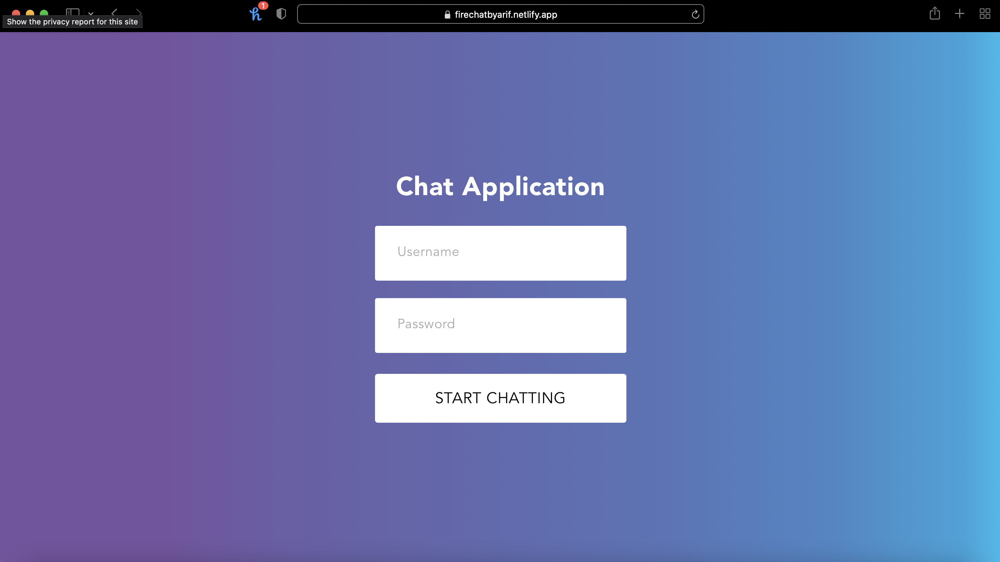

#  Fire Chat Application

 


##

## Live Demo
**https://firechatbyarif.netlify.app**
Username: Guest
Password: 1234
<br>

<p align="center">
  
</p>

<br>

## Description

What I Learned During the Build: Sockets, Rest APIs, Sending Images, React Hooks, Props, and CSS!

With online statuses, great design and functionality, icons telling you who read the message,
image support, sound notifications, the ability to create multiple rooms, and much more, 
I have also used PWA to modify the Web App and Turn into a PWA (progressive web application) and can be downloaded as an Nativ Web App.


## Getting Started


## Installation

Clone the repository

```bash
git clone https://github.com/mdarifuzzaman11/FireChat
```

## After Cloning Run the following code in Terminal of the project
#### Packages Installed during the Project
```
npx create-react-app FireChat --template cra-template-pwa
```
```
npm install @ant-design/icons axios react-chat-engine   
```


## Help

Any advise for common problems or issues.
```
command to run if program contains helper info
```

## Authors
MD Arifuzzaman 
<br />
[@_mdarifuzzaman](https://instagram.com/_mdarifuzzaman)

## Version History


* 1.0.0
    * Initial Release

## License

This project is licensed under the MIT License - see the LICENSE.md file for details
